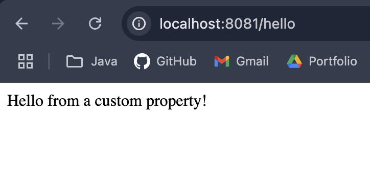

# Spring Boot Crash Course

**by:** Dzelle Faith Tan

This repository contains the completed work for the Spring Boot Crash Course.

## Session 1

## Challenge Lab 1: Customizing Server & Application Properties

This lab focused on modifying the application's default behavior by changing the server port and injecting custom values from the `application.properties` file.

**1. Configuration in `application.properties`**

This screenshot shows the configuration to change the server port to `8081` and define a custom greeting message.

**2. Output in Browser**

This screenshot shows the result of accessing the `/hello` endpoint, which now displays the custom message from the properties file.

**(Bonus) Running from the Command Line**

Command: `mvn spring-boot:run -Dspring-boot.run.arguments='--app.greeting.message="Hello from Command Line!"'`

This overrides properties directly from the command line using Maven. This is useful for changing configurations without modifying the code.

---

## Challenge Lab 2: Dynamic Endpoints with Request Parameters

This lab introduced creating flexible API endpoints that accept URL query parameters using the `@RequestParam` annotation.

**1. Output of `http://localhost:8081/greeting`**

**1. Output of `http://localhost:8081/greeting?name=Alice`**

This shows the endpoint accepting a `name` parameter to customize the greeting.

**2. Output of `http://localhost:8081/calculate/sum?num1=5&num2=10`**

This shows the endpoint taking two numbers as parameters and returning their sum.

---

## Challenge Lab 3: Returning Dynamic JSON Responses

This lab demonstrated how Spring Boot automatically converts Java data structures like `Map` and `List` into dynamic JSON responses.

**1. Returning a Map as JSON (`/info` endpoint)**

The `/info` endpoint returns a `Map`, which Spring Boot converts into a JSON object.

**2. Returning a List as JSON (`/features` endpoint)**

The `/features` endpoint returns a `List`, which Spring Boot converts into a JSON array.
